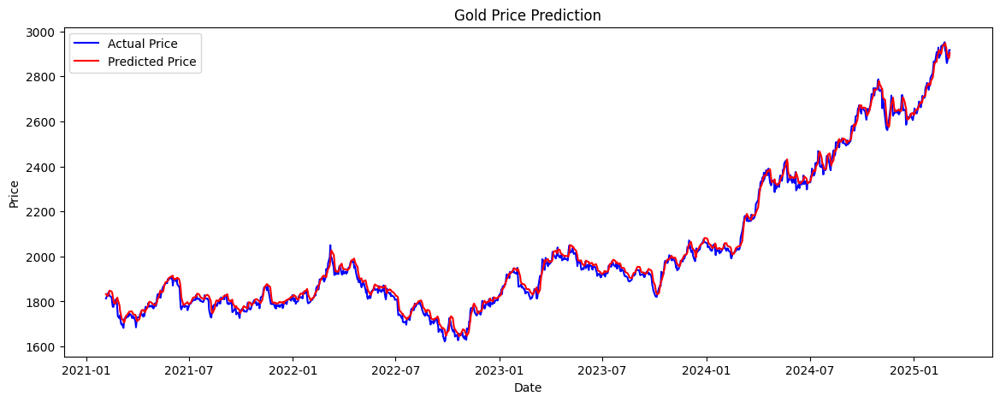
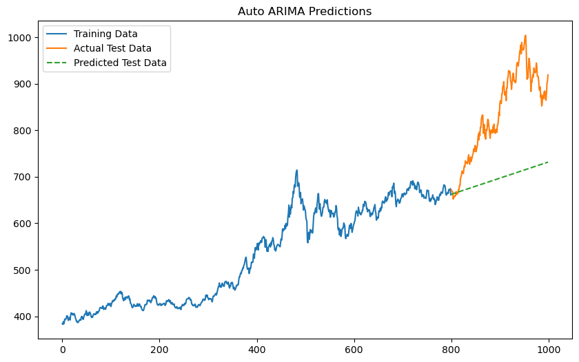
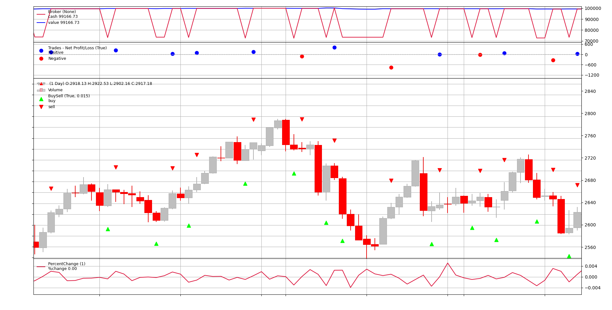

# 🏆 Gold Price Prediction using Machine Learning and LLMs

[](https://www.python.org/)
[](https://pytorch.org/)
[](https://pytorch.org/)
[](LICENSE)

A comprehensive AI project for predicting global gold prices by combining traditional time series analysis with advanced natural language processing techniques on financial news data.

## 📋 Project Overview

This undergraduate research project develops an intelligent system for gold price prediction by integrating:
- **Traditional time series models** (ARIMA)
- **Deep learning approaches** (LSTM, Diffusion Models)
- **Natural language processing** (News analysis with LLMs)
- **Unsupervised learning** (K-means clustering on news keywords)

The system demonstrates that hybrid approaches combining numerical price data with semantic news analysis can significantly improve prediction accuracy in volatile financial markets.


## 🎯 Key Features

### 1. **Multi-Source Data Collection**
- **Gold Price Data**: Historical daily, weekly, and monthly prices (2004-2025) from MetaTrader
- **Financial News**: Automated web scraping from BullionVault, Kitco, FXStreet
- **Economic Indicators**: Integration with relevant market factors

### 2. **Traditional Time Series Analysis**
- **ARIMA Modeling**: Baseline classical approach for price forecasting
- **Stationarity Analysis**: ADF tests and differencing for time series preprocessing

### 3. **Deep Learning Approaches**
- **LSTM Networks**: Advanced sequence modeling with memory cells
- **Performance Metrics**: R² = 0.978, RMSE = 47, RSMPE = 13.67%
- **Diffusion Models**: Experimental approach for time series generation

### 4. **News Semantic Analysis**
- **Keyword Clustering**: K-means on news keywords grouped by price change impact
- **TF-IDF Vectorization**: Text feature extraction for machine learning
- **Semantic Patterns**: Identifying news categories affecting gold prices

### 5. **Large Language Model Integration**
- **Multiple LLMs Tested**: 
  - Seed-OSS-36B (ByteDance)
  - Qwen3-32B (Alibaba)
  - GPT-OSS-20B
- **News Impact Prediction**: LLMs predict price changes from news content
- **Performance**: 62.2% accuracy in direction prediction, 20.14% mean percentage error

### 6. **Trading Simulation**
- **Backtesting Framework**: Strategy validation with Backtrader
- **Realistic Conditions**: Broker commissions and trading constraints
- **Performance Analysis**: Portfolio value tracking and risk assessment

## 📊 Results and Performance

### Model Comparison

| Model | R² Score | RMSE | RSMPE | Key Strength |
|-------|----------|------|-------|--------------|
| ARIMA | 0.85 | 89.2 | 18.3% | Linear patterns |
| LSTM | 0.978 | 47.0 | 13.67% | Non-linear trends |
| LLM (Seed-OSS) | - | - | 20.14% | News semantic understanding |

### Performance Visualization

#### LSTM Model Performance

*LSTM model showing excellent alignment between actual (blue) and predicted (red) prices*

#### ARIMA Performance

*ARIMA model demonstrating limited capability in capturing complex market dynamics*
#### Clustering Results

*Keyword clustering based on price change impact showing distinct market reaction patterns*

#### Trading Simulation Results

*Portfolio performance using LSTM-based trading strategy*

### Key Findings
- **LSTM outperforms ARIMA** in capturing non-linear patterns and sudden market shifts
- **LLMs provide valuable semantic insights** but require combination with numerical models
- **Hybrid approaches** (LSTM + clustering) show the most promise for real-world applications
- **News clustering** reveals meaningful patterns in market reactions to different event types

## 🛠️ Installation and Usage

### Prerequisites
```bash
Python 3.8+
Required libraries in requirements.txt
```

### Installation
```bash
git clone https://github.com/your-username/gold-price-prediction.git
cd gold-price-prediction
pip install -r requirements.txt
```

## 📈 Model Architecture Details

### LSTM Network
- **Input**: 60-day sequence of OHLC (Open, High, Low, Close) prices
- **Architecture**: Multiple LSTM layers with dropout regularization
- **Output**: Next day's opening price prediction
- **Training**: Adam optimizer with mean squared error loss
- **Performance**: R² = 0.978, RMSE = 47, RSMPE = 13.67%

### News Processing Pipeline
1. **Web Scraping**: Automated collection from financial news sites
   - Sources: BullionVault, Kitco, FXStreet, Reuters
   - Data: News titles, content, publication dates
2. **Text Preprocessing**: 
   - Cleaning and normalization
   - Tokenization and stopword removal
   - Stemming and lemmatization
3. **Feature Extraction**:
   - TF-IDF vectorization
   - Word embeddings
   - Keyword importance scoring
4. **Clustering**: 
   - K-means on price change correlated keywords
   - DBSCAN for outlier detection
   - Cluster analysis based on market impact
5. **LLM Analysis**:
   - Semantic understanding of news content
   - Impact prediction on gold prices
   - Multiple model comparison (Seed-OSS, Qwen3, GPT-OSS)

## 🔮 Future Work

- **Enhanced Data Integration**:
  - More economic indicators (inflation rates, USD index, interest rates)
  - Geopolitical event data
  - Market sentiment indicators

- **Advanced Modeling Techniques**:
  - Transformer-based models for time series forecasting
  - Ensemble methods combining multiple approaches
  - Reinforcement learning for trading strategies

- **System Improvements**:
  - Real-time prediction system deployment
  - Multi-asset correlation analysis
  - Advanced risk management in trading strategies
  - Cloud-based scalable architecture

- **Research Directions**:
  - Causal inference analysis
  - Explainable AI for financial predictions
  - Cross-market spillover effects

## 📚 References

1. **MetaTrader** - Gold historical price dataset (2004–2025)
2. **BullionVault** - Gold news and market updates
3. **Kitco** - Gold news and analysis
4. **Reuters** - Commodities market data
5. **FXStreet** - Financial news and technical analysis
6. **Backtrader** - Trading strategy backtesting framework
7. **Hugging Face** - Transformer models and embeddings

## 👥 Contributors

- **AmirReza Noruzi** - Project Developer & Researcher
- **Dr. Leila Sharifi** - Project Advisor & Supervisor

## 🙏 Acknowledgments

- University advisors and committee members for guidance and support
- Open-source community for providing essential ML libraries and tools
- Financial data providers for comprehensive market information
- Research community for foundational work in financial machine learning
